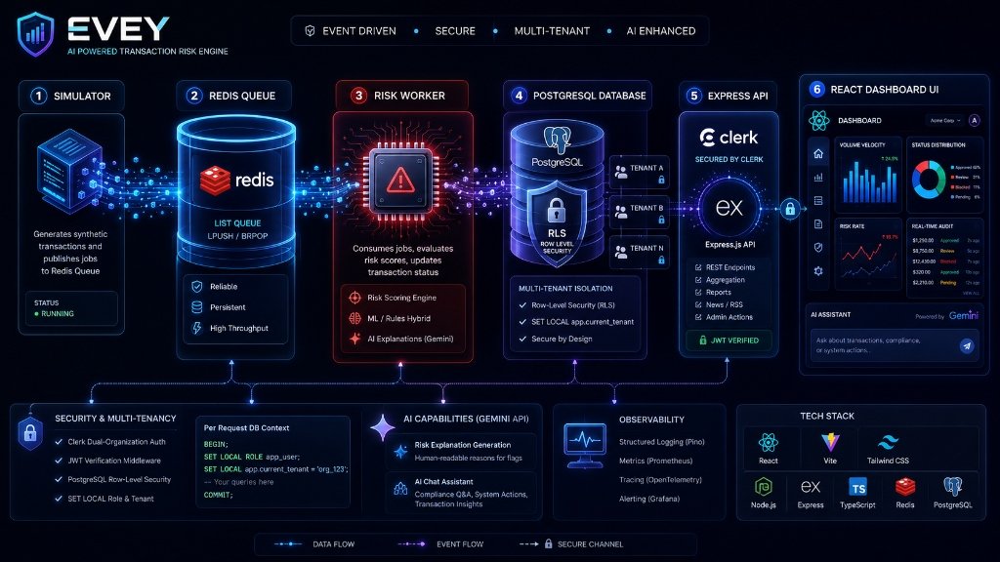

# EVEY — Real-Time Transaction Risk Engine

EVEY is a containerized, event-driven, multi-tenant transaction risk monitoring system. It processes simulated financial transactions, evaluates their risk asynchronously, and displays them on a glassmorphic React dashboard with AI-powered auditing and administrative overrides.



---

## 🚀 How to Run (Docker)

### Prerequisites
- [Docker](https://www.docker.com/) & Docker Compose
- A [Clerk](https://clerk.com/) account (Publishable Key and Secret Key)

### Step 1: Set up Environment Variables
Copy `.env.example` to `.env` in the root directory:
```bash
cp .env.example .env
```
Open `.env` and fill in your Clerk keys:
```env
CLERK_SECRET_KEY=sk_test_...
CLERK_PUBLISHABLE_KEY=pk_test_...
VITE_CLERK_PUBLISHABLE_KEY=pk_test_...

# Clerk Organization IDs (Admin & Merchant roles)
CLERK_MERCHANT_ORG_ID=org_...
CLERK_ADMIN_ORG_ID=org_...

# (Optional) GEMINI_API_KEY for AI features
GEMINI_API_KEY=AIzaSy...
```

### Step 2: Build and Start
Run the following command to start all services:
```bash
docker-compose up --build -d
```
Once up, access the applications at:
- **Frontend Dashboard:** [http://localhost:3000](http://localhost:3000)
- **API Server:** [http://localhost:4000](http://localhost:4000)

---

## ⚙️ Working Mechanism

```
[Simulator] ──(Generates Pending Tx)──> [Redis Queue] 
                                              │
[Postgres (RLS)] <──(Saves Score/Status)── [Worker]
       │
[Express API] <──(SET LOCAL ROLE/tenant)── [Clerk JWT Auth]
       │
[React Frontend] (Glassmorphic UI & AI Chat)
```

1. **Transaction Simulation**: The `simulator` service regularly generates synthetic transactions and pushes them to a Redis queue while storing them as `PENDING` in PostgreSQL.
2. **Asynchronous Risk Processing**: The `worker` consumes transactions from the Redis queue, applies risk logic, updates the transaction status (`APPROVED`, `REJECTED`, `FLAGGED`), and updates the Redis stats cache.
3. **Database-Level Multi-Tenancy (RLS)**: PostgreSQL enforces data isolation using Row-Level Security (RLS). The API dynamically sets the user's role (`app_user` for merchants or `app_admin` for risk admins) and `current_tenant` on every request.
4. **AI-Assisted Operations**: Using Google Gemini API, operators can request natural language explanations of transaction risk flags, download automated audit reports, or chat with a risk assistant.

---

## ✨ Features

- **Multi-Tenant Isolation**: Enforced via PostgreSQL Row-Level Security (RLS) policies based on Clerk Organization IDs.
- **Clerk Authentication**: Dynamic role-based permissions (`Merchants` vs. `Risk Admins`) matching the active user organization.
- **Interactive Analytics**: Beautiful responsive SVG charts displaying real-time metrics (Total, Flagged, Approved, and Rejected).
- **AI-Powered Audit & Explanations**: One-click AI explanations for flagged transactions and a risk engine AI Chatbot.
- **Live Updates**: High-performance transaction history feed with auto-polling.
- **Admin & Member Controls**: Admins can approve/reject/flag transactions, manage organization members, leave or delete organizations; members can review and flag transactions.
- **Financial News Feed**: Real-time caching and parsing of RSS feeds (MarketWatch, Yahoo Finance, Reuters, etc.).
- **Data Export**: Immediate CSV and HTML monthly transaction report generation.
- **Glassmorphic UI**: Sleek, fully responsive modern dark-mode dashboard with smooth scrolling and animations.
